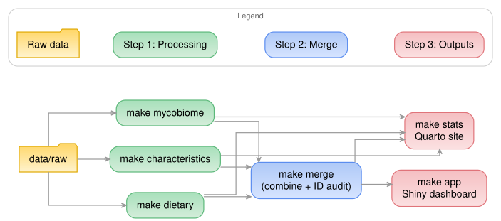

# IBD Mycobiome Dashboard (demo)

An R pipeline, Shiny dashboard, and Quarto statistics site for exploring how gut fungi (the mycobiome), diet, and inflammatory biomarkers relate to inflammatory bowel disease (IBD).

- **Dashboard:** https://iangault-ibd-dashboard-demo.share.connect.posit.cloud
- **Statistics site:** https://iangault.github.io/ibd-dashboard-demo/

> **All data in this repo is synthetic.** The original project used real patient data under a hospital data-use agreement and is kept private. This public version runs the same code on fake data from [`src/synth_data/generate_fake_raw_data.py`](src/synth_data/generate_fake_raw_data.py), so the numbers and figures here are not real findings.

## About this version

The original work was a 2026 UBC Master of Data Science capstone built with a hospital research partner by Tiffany Chu, Victoria Farkas, Ian Gault, and Derrick Jaskiel.

I made this public version so the project can be shared. Changes from the private original:

- A synthetic data generator that matches the original raw file schemas, so the full pipeline runs end to end
- The dashboard login (shinymanager) removed, since there is no real data to protect
- A GitHub Actions workflow that rebuilds and publishes the statistics site to GitHub Pages
- Patient data, results, and the capstone report removed

## What's in it

**Data pipeline** (`src/`): R scripts that clean and merge four data sources (stool mycobiome relative abundance, dietary intake, inflammatory biomarkers, and participant characteristics) into analysis-ready files. Run with `make`.

**Shiny dashboard** (`dashboard/`): participant-level and cohort-level views of fungal composition, diet, and biomarkers.

**Statistics site** (`stats/`): a Quarto website with one post per analysis, covering alpha diversity (Kruskal-Wallis), beta diversity (PERMANOVA at four taxonomic levels), symptom and nutrient associations, PCA and clustering, and an evidence-ranking matrix.



**Stack:** R (tidyverse, vegan, Shiny, bslib), Quarto, renv, GNU Make, GitHub Actions, Python (synthetic data only)

## Running it locally

Requires R 4.6.0, the [Quarto CLI](https://quarto.org/docs/get-started/), and GNU Make. The synthetic raw data is already committed in `data/raw/`.

```sh
git clone https://github.com/iangault/ibd-dashboard-demo.git
cd ibd-dashboard-demo

make setup                                    # restore R packages from renv.lock
make mycobiome dietary characteristics merge  # run the data pipeline
make app                                      # launch the dashboard
make stats                                    # render the stats site to stats/_site/
```

Other targets: `make test` (unit tests), `make r-check` (format and lint), `make clean`, and `make help` for the full list. To regenerate the synthetic data, run `python3 src/synth_data/generate_fake_raw_data.py` (needs pandas, numpy, openpyxl).

For platform-specific setup (Rtools on Windows, OpenSSL on macOS, installing `make`), troubleshooting, and deployment, see [HANDOVER.md](HANDOVER.md).

## Repository layout

```
src/         data cleaning and processing scripts, one folder per domain
dashboard/   Shiny app (ui.R, server.R, global.R, and modules in R/)
stats/       Quarto site: posts/, shared helpers in R/, frozen results in _freeze/
notebooks/   exploratory notebooks
tests/       testthat unit tests for the stats helpers
data/        raw/ (synthetic inputs), intermediate/ and processed/ (generated)
figures/     generated figures and pipeline diagrams
```

## License

MIT. See [LICENSE](LICENSE).
