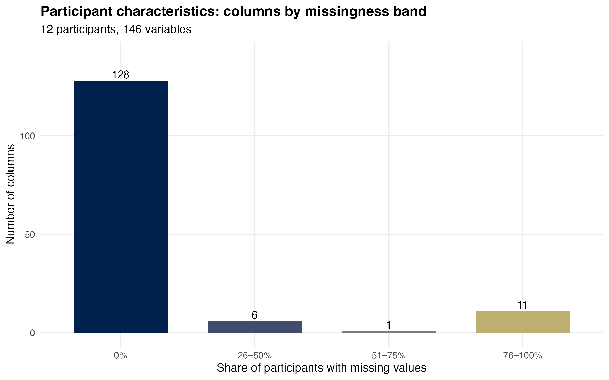
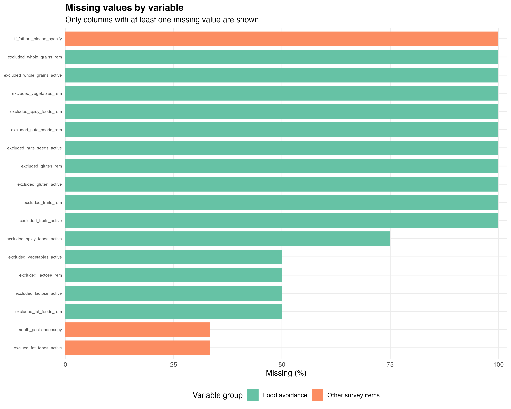
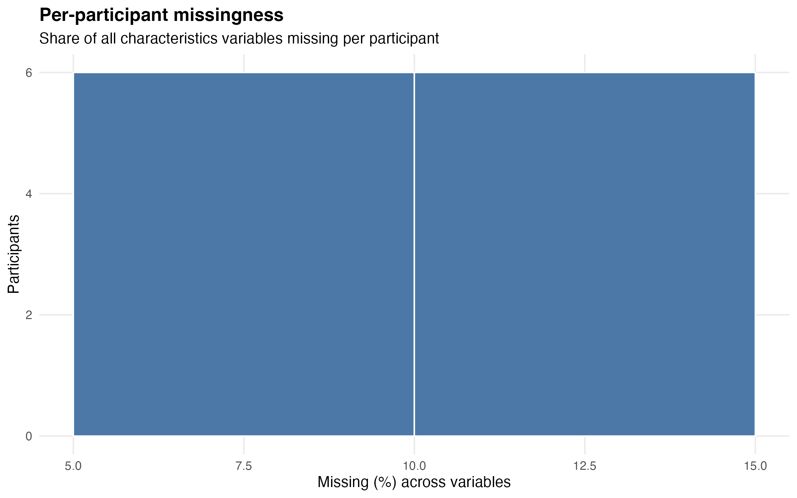
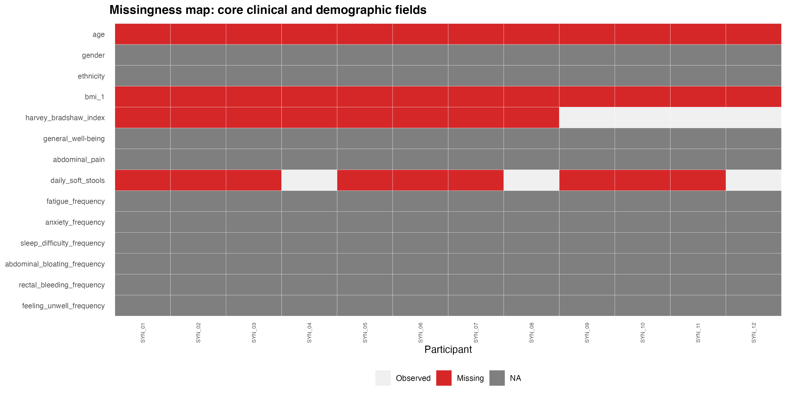

```{r}
#| label: setup
#| include: false
library(dplyr)
library(readr)
library(knitr)
library(here)

here::i_am("posts/2026-06-16-characteristics-missingness/index.qmd")

chars <- read_csv(
  here::here("..", "data", "processed", "cleaned_characteristics.csv"),
  show_col_types = FALSE
)

miss_pct <- colMeans(is.na(chars)) * 100
n_participants <- nrow(chars)
n_variables <- ncol(chars)

core_cols <- intersect(
  c(
    "age", "gender", "ethnicity", "bmi_1", "harvey_bradshaw_index",
    "general_well-being", "abdominal_pain", "daily_soft_stools",
    "fatigue_frequency", "anxiety_frequency"
  ),
  names(chars)
)

core_complete <- sum(complete.cases(chars[, core_cols, drop = FALSE]))
row_missing_pct <- rowMeans(is.na(chars)) * 100

# Values quoted in the Interpretation section
pct <- function(x) paste0(round(x), "%")
demo_cols <- intersect(c("age", "gender", "ethnicity", "comorbidities"), names(chars))
demo_max_miss <- max(miss_pct[demo_cols])
demo_text <- if (demo_max_miss == 0) "have no missing values" else paste("are at most", pct(demo_max_miss), "missing")
bmi_miss <- miss_pct[grep("^bmi", names(chars))[1]]
excluded_miss <- median(miss_pct[grep("^excluded_", names(chars))])
freq_miss <- miss_pct[grep("_freq", names(chars))]
bmi_text <- if (bmi_miss == 0) "BMI is complete" else paste("BMI is missing for", pct(bmi_miss), "of participants")
freq_text <- if (all(freq_miss == 0)) {
  paste("All", length(freq_miss), "**symptom-frequency items** are complete.")
} else {
  paste0(
    sum(freq_miss > 0), " of ", length(freq_miss), " **symptom-frequency items** have missing values ",
    "(up to ", pct(max(freq_miss)), " of participants), which affects analyses that join ",
    "characteristics to mycobiome samples (see the symptoms × composition post)."
  )
}
```

## Overview

This post documents **missingness** in `data/processed/cleaned_characteristics.csv` after the cleaning pipeline in `src/characteristics/characteristics.R`. The goal is descriptive: quantify where data are absent, which variable groups are most affected, and how complete the cohort is on fields used in downstream analyses. No hypothesis test is performed.

> Figures generated by `src/characteristics/01_missingness_eda.R` via `make characteristics`.

## Data

- **Unit of analysis:** Participant (one row per survey record in the characteristics file).
- **Input:** `data/processed/cleaned_characteristics.csv` (`make characteristics` on `data/raw/SYN_Participant Characteristics.xlsx`).
- **Scope:** All `r n_variables` columns after cleaning, including demographics, IBD clinical scores, symptom-frequency items, food-avoidance blocks, and ancillary survey fields.

**Cohort size:** `r n_participants` participants, `r n_variables` variables.

**Columns with no missing values:** `r sum(miss_pct == 0)` (`r round(100 * sum(miss_pct == 0) / n_variables, 1)`% of variables).

**Median participant missingness:** `r round(median(row_missing_pct), 1)`% of variables missing per person (max `r round(max(row_missing_pct), 1)`%).

**Complete on core clinical/demographic fields** (`r length(core_cols)` variables): `r core_complete` / `r n_participants` participants.

## Methods

| Item | Choice |
|------|--------|
| Missing definition | `NA` after cleaning (blank cells, failed coercion, or scrubbed impossible values) |
| Column summaries | Count and percent missing per variable |
| Participant summaries | Percent of variables missing per participant |
| Variable grouping | Rule-based labels (demographics, IBD clinical, symptom frequency, food avoidance, etc.) |
| Statistical test | None — exploratory audit only |

## Figures

### Missingness bands across variables

How many columns fall into each missingness range.



### Variable-level missing rates

All variables with at least one missing value, coloured by survey domain.



### Participant-level burden

Distribution of how many variables are missing per participant.



### Core clinical and demographic fields

Missingness pattern for fields most often used in symptom and cohort summaries.



## Highest-missing variables

```{r}
#| label: top-missing-table
#| echo: false
miss_tbl <- tibble(
  Variable = names(chars),
  `Missing n` = colSums(is.na(chars)),
  `Missing %` = round(miss_pct, 1)
) |>
  filter(`Missing %` > 0) |>
  arrange(desc(`Missing %`), Variable)

knitr::kable(head(miss_tbl, 15), row.names = FALSE)
```

## Interpretation

Missingness varies across the survey. After cleaning, the demographic fields (age, gender, ethnicity, comorbidities) `r demo_text`, and `r bmi_text`. **Conditional follow-up fields**, such as the food-avoidance "excluded ..." columns, are a median `r pct(excluded_miss)` missing. These only apply when a participant reports avoidance, so high missingness is expected.

`r freq_text` `r core_complete` of `r n_participants` participants have complete data across the `r length(core_cols)` core clinical fields listed above.

**Implications for analysis:**

- Treat food-avoidance and free-text exclusion columns as **sparse optional modules**, not core covariates.
- For symptom scores, report **available N** per variable and consider sensitivity analyses restricted to complete cases.
- The cleaning pipeline imputes or recodes some fields (e.g. median age for missing age, `"missing"` ethnicity, `"none"` comorbidities); this audit reflects **post-cleaning** missingness on fields left as `NA`.

## Reproducibility

- **Cleaning:** `src/characteristics/characteristics.R`
- **Missingness figures:** `src/characteristics/01_missingness_eda.R`
- **Rendered:** `make characteristics` then `quarto render stats` from repository root
